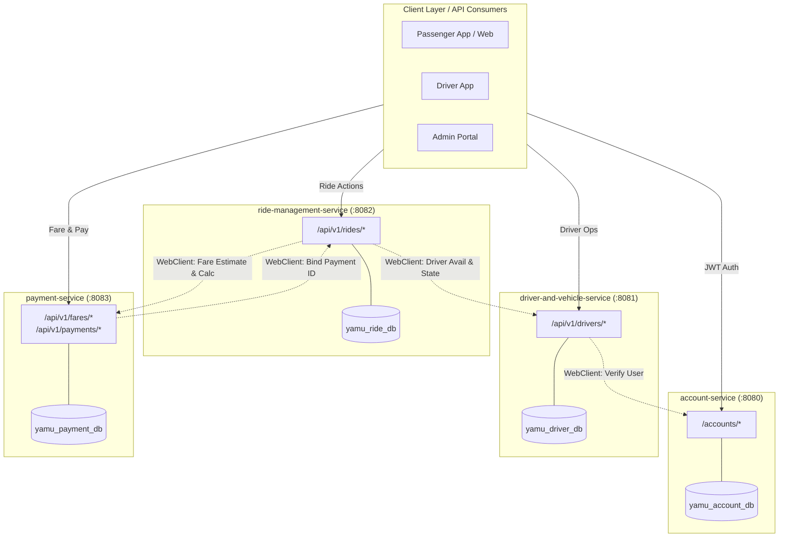

# YAMU Backend - Ride Management Platform

[](https://www.oracle.com/java/)
[](https://spring.io/projects/spring-boot)
[](https://maven.apache.org/)
[](https://www.mongodb.com/)
[](LICENSE)

YAMU is a distributed, multi-module ride management platform backend developed using **Spring Boot**, **Spring Security (stateless JWT)**, **Spring Data MongoDB**, and **Spring WebFlux (reactive WebClient)**. It adheres to microservices principles with dedicated database boundaries per service and non-blocking interservice communication.

---

## Architecture Overview

```
YAMU-backend/
├── pom.xml                               # Aggregator Maven POM
├── YAMU_Postman_Collection.json          # Repeatable Postman test suite (Workflows 1-7)
├── account-service/                      # Port 8080: Auth, RBAC, User Profiles
├── driver-and-vehicle-service/           # Port 8081: Driver profiles, Vehicles & Telemetry
├── ride-management-service/              # Port 8082: Ride State Machine & Dispatching
└── payment-service/                      # Port 8083: Dynamic Fare Engine & Settlements
```

### Microservices Communication Matrix



---

## 1. Prerequisites

Before running the microservices, ensure the following software is installed and available in your environment:

- **Java Development Kit (JDK):** Version 17 or higher (JDK 17, 21, or 23 supported).
- **Apache Maven:** Version 3.8.0 or higher.
- **MongoDB:** A running MongoDB instance (version 5.0+) accessible on port `27017`.
- **API Client:** [Postman](https://www.postman.com/) (recommended) or [cURL](https://curl.se/) / [Newman](https://www.npmjs.com/package/newman).

### Starting MongoDB via Docker (Fastest Option)
If MongoDB is not installed locally, launch it in Docker with a single command:
```bash
docker run -d --name yamu-mongo -p 27017:27017 mongo:latest
```

---

## 2. Configuration & Environment Variables

Each service is pre-configured with safe development defaults and supports environment variable overrides:

### Common Environment Variables

| Variable | Description | Default Value |
| :--- | :--- | :--- |
| `JWT_SECRET` | 256-bit secret used for HMAC-SHA signing | `node -e "console.log(require('crypto').randomBytes(64).toString('hex'))"` |
| `JWT_EXPIRATION_MS`| JWT token validity in milliseconds | `86400000` (24 hours) |
| `MONGODB_URI` | Base connection string for MongoDB | `mongodb+srv://<db_username>:<db_password>@account-db................` |

### Service-Specific Ports & Database Boundaries

| Service | Port | Database Name | Interservice URL Variables |
| :--- | :--- | :--- | :--- |
| **`account-service`** | `8080` | `yamu_account_db` | `DRIVER_SERVICE_URL`, `RIDE_SERVICE_URL`, `PAYMENT_SERVICE_URL` |
| **`driver-and-vehicle-service`**| `8081` | `yamu_driver_db` | `ACCOUNT_SERVICE_URL`, `RIDE_SERVICE_URL`, `PAYMENT_SERVICE_URL` |
| **`ride-management-service`** | `8082` | `yamu_ride_db` | `ACCOUNT_SERVICE_URL`, `DRIVER_SERVICE_URL`, `PAYMENT_SERVICE_URL` |
| **`payment-service`** | `8083` | `yamu_payment_db` | `ACCOUNT_SERVICE_URL`, `DRIVER_SERVICE_URL`, `RIDE_SERVICE_URL` |

---

## 3. Recommended Start-Up Order

Because services interconnect through reactive HTTP `WebClient` requests, launch the components in the following order:

1. **MongoDB Database:** Must be running on port `27017` before any service boots.
2. **`account-service` (Port 8080):** Central identity and authentication provider. Issues and validates JWTs for other services.
3. **`driver-and-vehicle-service` (Port 8081):** Manages driver fleet, vehicles, and live availability.
4. **`payment-service` (Port 8083):** Provides pricing rules and processes settlements.
5. **`ride-management-service` (Port 8082):** Central orchestrator. Queries driver availability from port 8081 and fare estimates from port 8083.

---

## 4. Build and Run Commands

### A. Build Entire Multi-Module Project
From the root repository directory (`YAMU-backend/`):
```bash
# Clean and compile all modules
mvn clean compile

# Or compile and package all modules into JARs
mvn clean package -DskipTests
```

### B. Run Each Microservice

Run each service in a separate terminal window:

#### Terminal 1: Account Service (Port 8080)
```bash
mvn spring-boot:run -pl account-service
```

#### Terminal 2: Driver & Vehicle Service (Port 8081)
```bash
mvn spring-boot:run -pl driver-and-vehicle-service
```

#### Terminal 3: Payment Service (Port 8083)
```bash
mvn spring-boot:run -pl payment-service
```

#### Terminal 4: Ride Management Service (Port 8082)
```bash
mvn spring-boot:run -pl ride-management-service
```

### C. Running Packaged JARs Directly
```bash
java -jar account-service/target/account-service-1.0-SNAPSHOT.jar
java -jar driver-and-vehicle-service/target/driver-and-vehicle-service-1.0-SNAPSHOT.jar
java -jar payment-service/target/payment-service-1.0-SNAPSHOT.jar
java -jar ride-management-service/target/ride-management-service-1.0-SNAPSHOT.jar
```

---

## 5. Test Instructions

### A. Running Automated Unit Tests
To execute all 30+ unit tests across all 4 microservices with detailed reports:
```bash
mvn test
```

To run unit tests for a single microservice:
```bash
# Account Service tests
mvn test -pl account-service

# Driver Service tests
mvn test -pl driver-and-vehicle-service

# Ride Service tests
mvn test -pl ride-management-service

# Payment Service tests
mvn test -pl payment-service
```

### B. Running the Postman Collection (End-to-End Workflows)

A pre-configured, automated test collection is located at:
`./YAMU_Postman_Collection.json`

#### Option 1: Import into Postman UI
1. Open **Postman**.
2. Click **Import** $\to$ drag and drop `YAMU_Postman_Collection.json`.
3. Open the imported collection: **"YAMU Backend Microservices API Collection"**.
4. Click **Run Collection** to execute all 7 workflows sequentially.
   - The test scripts automatically extract tokens (`passenger_token`, `driver_token`), IDs (`passenger_id`, `driver_id`, `ride_id`, `payment_id`), and feed them into successive requests.

#### Option 2: Run via Newman CLI
```bash
npx newman run YAMU_Postman_Collection.json --reporters cli
```

---

## 6. Endpoint Locations & Interactive Documentation

Every microservice features interactive **Swagger UI** with pre-configured JWT Bearer authentication:

| Service | Swagger UI Web Interface | OpenAPI 3.0 JSON Specification |
| :--- | :--- | :--- |
| **Account Service** | [http://localhost:8080/swagger-ui.html](http://localhost:8080/swagger-ui.html) | [http://localhost:8080/v3/api-docs](http://localhost:8080/v3/api-docs) |
| **Driver Service** | [http://localhost:8081/swagger-ui.html](http://localhost:8081/swagger-ui.html) | [http://localhost:8081/v3/api-docs](http://localhost:8081/v3/api-docs) |
| **Ride Service** | [http://localhost:8082/swagger-ui.html](http://localhost:8082/swagger-ui.html) | [http://localhost:8082/v3/api-docs](http://localhost:8082/v3/api-docs) |
| **Payment Service** | [http://localhost:8083/swagger-ui.html](http://localhost:8083/swagger-ui.html) | [http://localhost:8083/v3/api-docs](http://localhost:8083/v3/api-docs) |

### Complete API Endpoint Directory

#### 1. Account Service (`http://localhost:8080`)
| Method | Path | Access | Description |
| :--- | :--- | :--- | :--- |
| `POST` | `/accounts/register` | Public | Register passenger, driver, or admin account |
| `POST` | `/accounts/login` | Public | Authenticate credentials and receive signed JWT |
| `GET` | `/accounts/{id}` | Owner / ADMIN | Retrieve user account and profile |
| `PUT` | `/accounts/{id}` | Owner / ADMIN | Update personal profile details |
| `PATCH` | `/accounts/{id}/status` | `ROLE_ADMIN` | Change status (`ACTIVE`, `SUSPENDED`, `DEACTIVATED`) |

#### 2. Driver & Vehicle Service (`http://localhost:8081`)
| Method | Path | Access | Description |
| :--- | :--- | :--- | :--- |
| `POST` | `/api/v1/drivers` | `DRIVER` / `ADMIN` | Register operational driver and vehicle details |
| `GET` | `/api/v1/drivers/{id}` | Authenticated | Retrieve driver operational profile |
| `GET` | `/api/v1/drivers/user/{userId}`| Authenticated | Find driver profile by Account user ID |
| `PUT` | `/api/v1/drivers/{id}/vehicle` | `DRIVER` / `ADMIN` | Update vehicle details |
| `PATCH` | `/api/v1/drivers/{id}/availability` | `DRIVER` / `ADMIN` | Update availability (`AVAILABLE`, `ON_TRIP`, `OFFLINE`) |
| `PATCH` | `/api/v1/drivers/{id}/location` | `DRIVER` / `ADMIN` | Ingest simulated GPS latitude/longitude |
| `GET` | `/api/v1/drivers/available` | Public / Interservice | Query available drivers by service area & vehicle type |

#### 3. Ride Management Service (`http://localhost:8082`)
| Method | Path | Access | Description |
| :--- | :--- | :--- | :--- |
| `POST` | `/api/v1/rides` | `PASSENGER` / `ADMIN`| Create new ride (auto-fetches fare estimate) |
| `GET` | `/api/v1/rides/{id}` | Authenticated | Retrieve ride status and metadata |
| `GET` | `/api/v1/rides/passenger/{id}` | Authenticated | Get all rides for a passenger |
| `GET` | `/api/v1/rides/driver/{id}` | Authenticated | Get all rides for a driver |
| `POST` | `/api/v1/rides/{id}/assign` | Authenticated | Assign eligible driver (`REQUESTED` $\to$ `ASSIGNED`) |
| `PATCH` | `/api/v1/rides/{id}/accept` | `DRIVER` / `ADMIN` | Driver accepts ride (`ASSIGNED` $\to$ `ACCEPTED`) |
| `PATCH` | `/api/v1/rides/{id}/start` | `DRIVER` / `ADMIN` | Start trip (`ACCEPTED` $\to$ `IN_PROGRESS`, sets driver `ON_TRIP`) |
| `PATCH` | `/api/v1/rides/{id}/complete` | `DRIVER` / `ADMIN` | Complete trip (`IN_PROGRESS` $\to$ `COMPLETED`, auto-calc fare) |
| `PATCH` | `/api/v1/rides/{id}/cancel` | Participants / ADMIN | Cancel trip (releases driver to `AVAILABLE`) |
| `GET` | `/api/v1/rides/{id}/history` | Authenticated | Retrieve immutable state transition audit history |

#### 4. Fare & Payment Service (`http://localhost:8083`)
| Method | Path | Access | Description |
| :--- | :--- | :--- | :--- |
| `POST` | `/api/v1/fares/estimate` | Public / Interservice | Estimate fare by distance, duration, and vehicle type |
| `POST` | `/api/v1/fares/calculate` | Public / Interservice | Compute final itemized fare with surge pricing |
| `POST` | `/api/v1/payments` | `PASSENGER` / `ADMIN`| Settle payment and issue digital receipt |
| `GET` | `/api/v1/payments/{id}` | Authenticated | Query payment record by ID |
| `GET` | `/api/v1/payments/ride/{rideId}`| Authenticated | Query payment record for a ride |
| `GET` | `/api/v1/payments/{id}/receipt` | Authenticated | Retrieve digital invoice receipt |
| `GET` | `/api/v1/receipts/ride/{rideId}`| Authenticated | Retrieve digital receipt for a ride |

---

## 7. Sample Credentials & Test Data

### A. Pre-configured Sample User Accounts

#### 1. Passenger
```json
{
  "email": "nimal.passenger@yamu.lk",
  "password": "Pass@12345",
  "role": "PASSENGER"
}
```

#### 2. Driver
```json
{
  "email": "sunil.driver@yamu.lk",
  "password": "Pass@12345",
  "role": "DRIVER"
}
```

#### 3. Administrator
```json
{
  "email": "admin@yamu.lk",
  "password": "Admin@12345",
  "role": "ADMIN"
}
```

---

### B. Sample Payloads for End-to-End Walkthrough

#### 1. Register Driver Profile (`POST http://localhost:8081/api/v1/drivers`)
```json
{
  "userId": "<ACCOUNT_USER_ID_FROM_REGISTER>",
  "licenseNumber": "B8899112",
  "serviceArea": "Colombo",
  "vehicle": {
    "licensePlate": "WP-CAB-4455",
    "make": "Toyota",
    "model": "Prius",
    "year": 2021,
    "color": "Pearl White",
    "vehicleType": "CAR",
    "capacity": 4
  }
}
```

#### 2. Update Driver Telemetry (`PATCH http://localhost:8081/api/v1/drivers/{driverId}/location`)
```json
{
  "latitude": 6.9271,
  "longitude": 79.8612,
  "address": "Kollupitiya, Colombo 03"
}
```

#### 3. Fare Estimate (`POST http://localhost:8083/api/v1/fares/estimate`)
```json
{
  "distanceKm": 8.5,
  "durationMinutes": 18.0,
  "vehicleType": "CAR",
  "surgeMultiplier": 1.0
}
```

#### 4. Create Ride Request (`POST http://localhost:8082/api/v1/rides`)
```json
{
  "pickupLocation": {
    "address": "Galle Face Green, Colombo 01",
    "latitude": 6.9271,
    "longitude": 79.8441,
    "city": "Colombo"
  },
  "destinationLocation": {
    "address": "Bambalapitiya, Colombo 04",
    "latitude": 6.8920,
    "longitude": 79.8550,
    "city": "Colombo"
  },
  "requestedVehicleType": "CAR",
  "estimatedDistanceKm": 5.0,
  "estimatedDurationMinutes": 15.0
}
```

#### 5. Settle Payment (`POST http://localhost:8083/api/v1/payments`)
```json
{
  "rideId": "<RIDE_ID>",
  "passengerId": "<PASSENGER_ID>",
  "driverId": "<DRIVER_ID>",
  "amount": 750.00,
  "paymentMethod": "CARD"
}
```

#### 6. Simulated Payment Failure (Negative Scenario) (`POST http://localhost:8083/api/v1/payments`)
```json
{
  "rideId": "neg-ride-fail-001",
  "driverId": "<DRIVER_ID>",
  "amount": 750.00,
  "paymentMethod": "CARD",
  "simulateFailure": true,
  "failureReason": "INSUFFICIENT_FUNDS"
}
```
*Returns `402 Payment Required` and records transaction as `FAILED`.*

---

## 8. Troubleshooting & Common Issues

- **MongoDB Connection Refused:** Ensure `mongod` is running on `localhost:27017` or start the Docker container with `docker start yamu-mongo`.
- **Port Conflict (`Address already in use`):** Ensure ports `8080`, `8081`, `8082`, and `8083` are not occupied by other background processes.
- **JWT 401 Unauthorized:** Ensure the `Authorization` header is present and prefixed with `Bearer ` (e.g., `Bearer eyJhbGci...`).
- **Interservice Timeouts:** Ensure all services are running when executing multi-service workflows (such as ride completion which triggers cross-service fare and availability updates).
